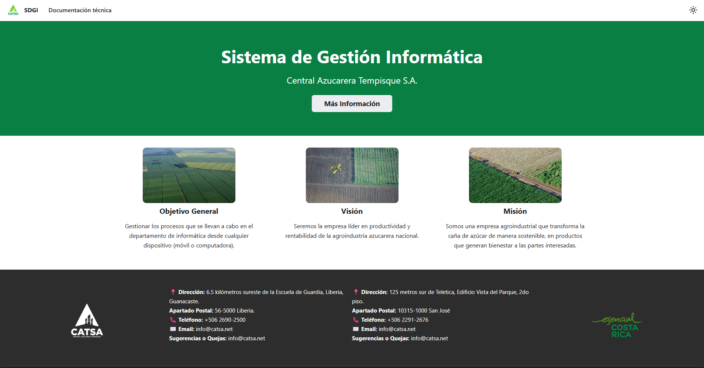
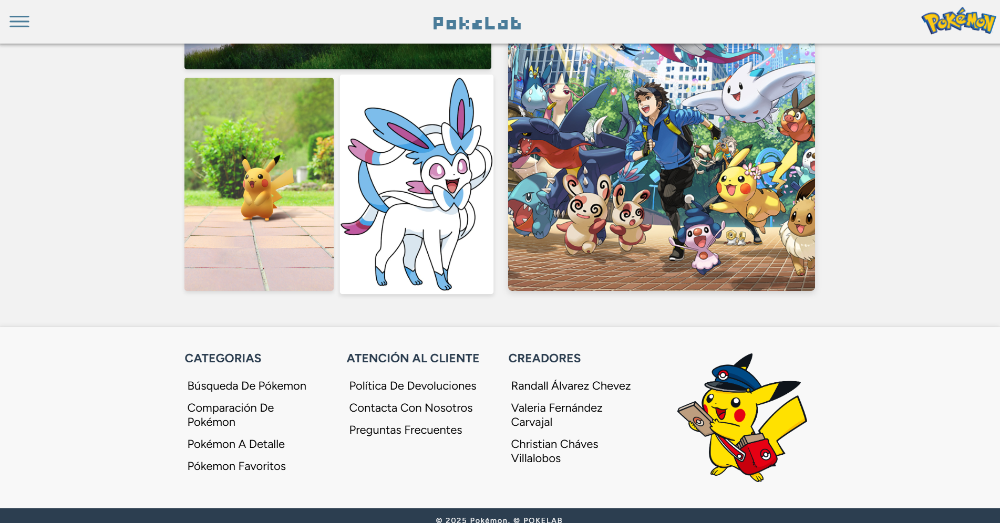

<h1 align="center">Hola soy Randall 👋</h1> 

  
  
  
  

 

## Sobre mí 

🎓 Estudiante de Ingeniería en Sistemas en la Universidad Nacional de Costa Rica (UNA).

👨‍💻 Me interesa el desarrollo backend, especialmente el diseño y construcción de APIs.

🚀 Siempre estoy buscando aprender nuevas tecnologías y mejorar mis habilidades como desarrollador.

📫 **Contacto**: randall.alvarez.ch@gmail.com

 

## Tecnologías conocidas 👨🏻‍💻

  

  
  
  

 

## Algunos proyectos 👨🏻‍💻

<table align="left">
<tr>
  <td width="25%" align="center">
    
    

      
    

  </td>

  <td width="25%" align="center">
    
    

      
    

  </td>
</tr>
</table>

         

## GitHub :octocat:

<table align="left">
<tr>
<td width="60%" align="center">
  
</td>
<td width="40%" align="center">
  
</td>
</tr>
</table>

  

